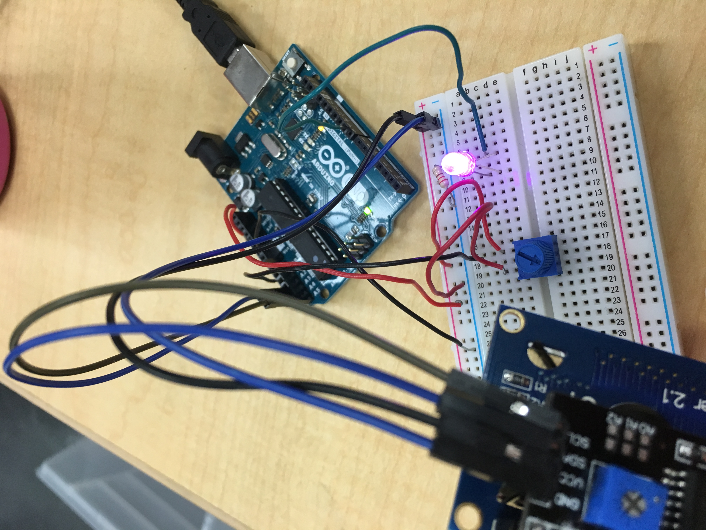
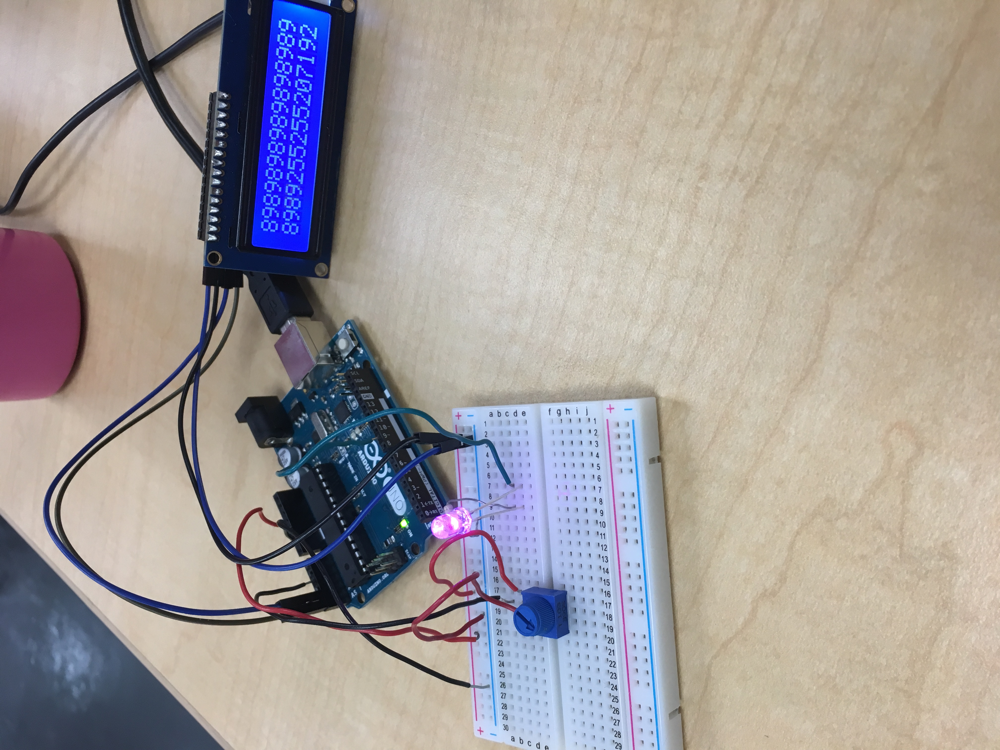

# IntermediateArduino
Intermediate arduino assignments. This is coding, wiring, and any complications of each 

## FadeLED
### Description
I made the brightness of a light fade high to low, and then low to high. An LED goes to a value of 255, so I made the value of the LED go up by 5 until it reaches 255, which then makes the number go down.
### Wiring

* Credit goes to [Dr. Shields](https://github.com/DoctorShields/CircuitPython)
### Problems and Solutions
My problems stemmed from trying to remember how to work and LED. It was the begining of the year, and I was trying to remember how to wire up the LED to make it work. Here is a link to LED Blink with a picture of how to wire it. https://www.arduino.cc/en/tutorial/blink

## HelloLCD
### Description
The goal was to use an LCD instead of a serial monitor. On one line in the LCD, I printed "Hello World", and on the second line, the LCD counted up the seconds since it started running. 
### Wiring

* Credit goes to [Lukas Miller](https://github.com/lmiller87/CircuitPython)
### Problems and Solutions
The main problems I had was wiring everything up. There were a lot of wires to keep track of and the board got quite crowded fast. The key is to follow the diagram exactly as it looks like. https://www.arduino.cc/en/Tutorial/HelloWorld

## LCDBackpack
### Description
Simplifies the wiring of an LCD. It counts how many times a button is pressed and displays it on the LCD.
### Wiring

### Problems and Solutions
The only problems were finding a backpack that fit into the LCD. Make sure there is either a male backpack and a female LCD, or a female backpack and a male LCD. LCD backpack is a lot easier than the normal LCD though. I liked that there were less wires. 

## Motor Control
### Description
Makes a motor go faster or slower with a potentiometer. 
### Wiring

### Problems and Solutions
Issues I had was wiring everything together. There are a lot of new pieces like the transistor and the diode. The transistor goes from output to input, and the diode lets electricity to pass from one end, and inhibits it from another.

## Photointerrupters
### Description
Makes a photointerrupter work with if statements, and without attach interrupt. This is separate from Attach interupt because I wanted to compare the two methods of making the same thing happen.
### Wiring

### Problems and Solutions
Making the if statements work was the biggest issue. If something is in the way, the light turns on. I had to figure out how to code when there was something in the way of the code.

## Attach Interrupt
### Description
I used Photointerrupters without if statements. Instead, I used an on function and off function. That when the interrupter gets something in the way, it is off and turns on the light, and vice versa. We used an Attach interrupt code that states that when something gets in the way, the code reacts.
### Wiring

### Problems and Solutions
My biggest issue was figuring out how the AttachInterrupt command worked. I figured out that it is specific to Photointerrupters, and that it reads if there is something interrupting the code.

## Potentiometer
### Description
An LCD prints the inputs on a potentiometer.
### Wiring

### Problems and Solutions

