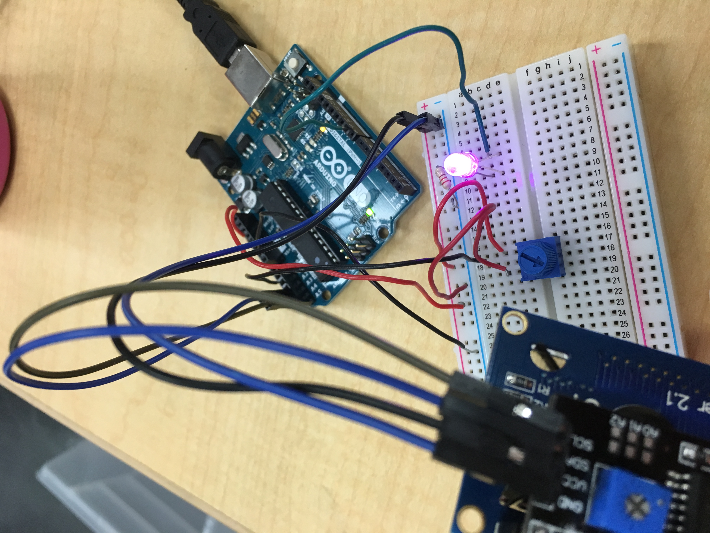
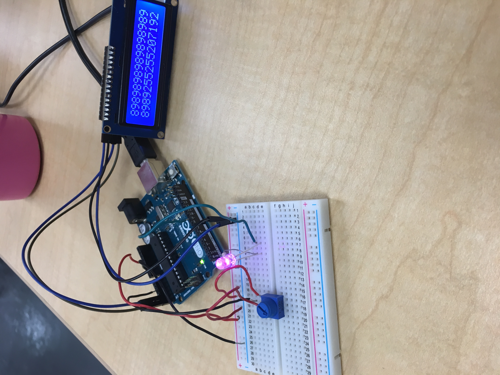
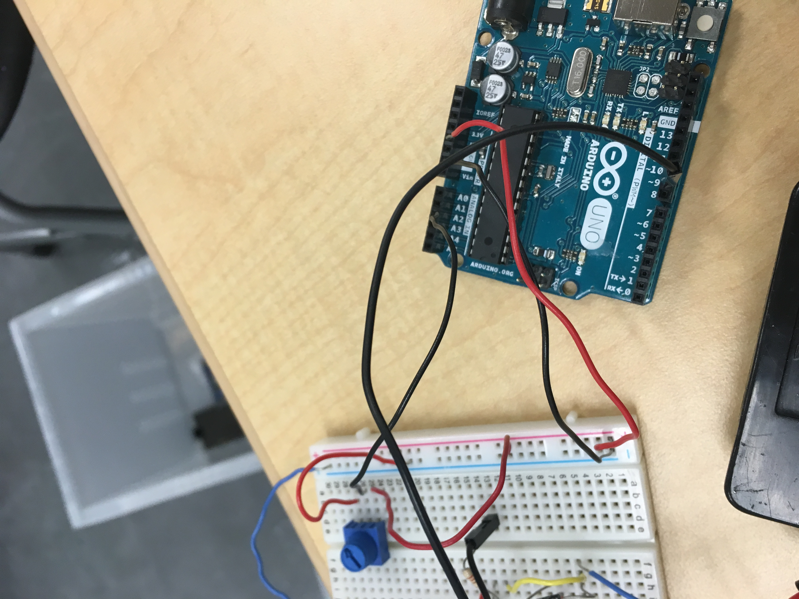
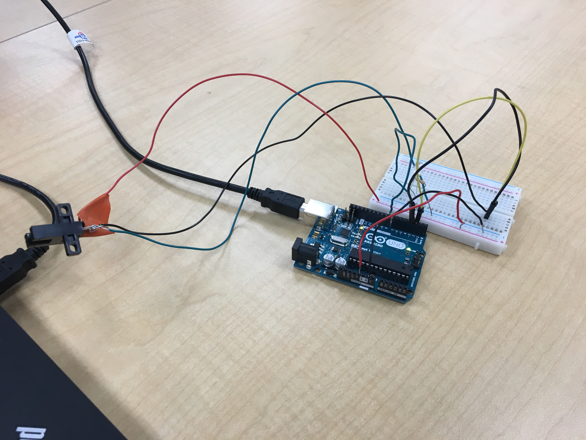

# IntermediateArduino
Intermediate arduino assignments

## Attach Interrupt
### Description
I used Photointerrupters w/out if statements. Instead, I used an on function and off function. That when the interrupter gets something in the way, it is off and turns on the light, and vice versa. We used an Attach interrupt code that states that when something gets in the way, the code reacts.

### Wiring

### Invaluable information
AKa what obstacles did you overcome, what tips would you give the reader, etc?

## FadeLED
### Description

### Wiring

### Invaluable information
Made an LED Fade

## HelloLCD
### Description

### Wiring

### Invaluable information
Prints "Hello World" and counts the seconds since it was run on an LCD monitor

## LCDBackpack
### Description

### Wiring

### Invaluable information
Simplifies the wiring of an LCD. It counts how many times a button is pressed and displays it on the LCD.

## Motor Control
### Description

### Wiring

### Invaluable information
Makes a motor go faster or slower with a potentiometer.

## Photointerrupters
### Description

### Wiring

### Invaluable information
Made a photointerrupter work w/ if statements

## Potentiometer
### Description

### Wiring

### Invaluable information
An LCD prints the inputs on a potentiometer.

